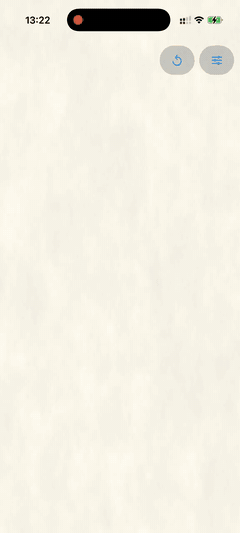

# BurningPaper

BurningPaper is a native SwiftUI and Metal package that simulates paper
burning away from interactive or programmatic ignition points. Burned regions
become transparent, revealing the content behind the paper.



## Features

- SwiftUI component with built-in tap and continuous drag ignition
- Programmatic point, path, and reset controls using normalized coordinates
- Persistent GPU simulation for damage, heat, char, and ash
- Procedural paper color, grain, fibers, and wrinkles
- Tunable propagation, edge, stain, glow, flame, smoke, and embers
- Transparent burned regions for layered reveals and transitions
- Independent simulation state for each view
- Lower-level Metal renderer for custom view integrations

## Requirements

- iOS 18 or later
- Xcode 16 or later
- A Metal-capable iPhone or iPad, or an iOS simulator

Your local simulator or device OS may require a newer Xcode and SDK. Xcode 26
is not a package requirement. CI checks both the oldest installed stable Xcode
16+ toolchain and the latest stable toolchain on GitHub's macOS runners.

## Installation

In Xcode, choose **File > Add Package Dependencies** and enter:

```text
https://github.com/blvdesign/BurningPaperShader
```

Select the `BurningPaper` product and add it to your application target.

## SwiftUI usage

Place the paper above the content it should reveal. The controller must remain
alive for as long as the view is in use.

```swift
import BurningPaper
import SwiftUI

struct ContentView: View {
    @StateObject private var burnController = BurningPaperController()

    var body: some View {
        ZStack {
            Color.red
            BurningPaperView(controller: burnController)
        }
        .ignoresSafeArea()
    }
}
```

Tap or drag across the view to ignite it. Pass `isInteractive: false` when the
surface should respond only to controller commands.

## Programmatic control

Controller points are normalized to the view: `(0, 0)` is the top-left and
`(1, 1)` is the bottom-right. Values outside that range are clamped.

```swift
burnController.ignite(at: CGPoint(x: 0.5, y: 0.5))
burnController.ignite(path: [
    CGPoint(x: 0.2, y: 0.4),
    CGPoint(x: 0.8, y: 0.6)
])
burnController.reset()
```

## Configuration

Create a configuration and pass it to `BurningPaperView`. Unsafe values are
sanitized before they reach Metal.

```swift
let configuration = BurningPaperConfiguration(
    burnSpeed: 1.1,
    spreadRate: 1.25,
    glowAmount: 0.55,
    paperWrinkleAmount: 0.65,
    smokeAmount: 0.2
)

BurningPaperView(
    controller: burnController,
    configuration: configuration
)
```

See [Tuning](docs/TUNING.md) for every parameter, valid range, and practical
adjustment guidance.

## Lower-level renderer

`BurningPaperRenderer` is available for applications that own an `MTKView` or
need custom view composition. It conforms to `MTKViewDelegate`, accepts the
same configuration, and exposes normalized point/path ignition and reset
commands. The view must use the renderer's Metal device and pixel format with
`sampleCount == 1`; call `isCompatible(with:)` before assigning the delegate.
Most applications should start with `BurningPaperView`.

## Architecture and performance

Each component owns a persistent, double-buffered GPU state texture. A Metal
compute pass advances burn, heat, char, and ash; a render pass turns that state
into procedural paper and transparent burned regions. Shaders are compiled as
package resources and loaded from `Bundle.module`.

The simulation texture preserves aspect ratio and caps its longest dimension
at 1024 pixels. Ignition work and pending input are bounded per frame to keep
fast gestures responsive. For details, see
[Architecture](docs/ARCHITECTURE.md).

## Example app

1. Clone the repository.
2. Open `Example/BurningPaperExample.xcodeproj` in Xcode.
3. Select the `BurningPaperExample` scheme and an iOS 18 or later simulator or
   device.
4. Choose a development team if a device build requires signing, then run.

The Example uses the package from the repository root and includes live tuning
controls. Its generated abstract background is demonstration media only.

## Project information

- [Attributions and visual inspiration](ATTRIBUTIONS.md)
- [Contributing](CONTRIBUTING.md)
- [Changelog](CHANGELOG.md)
- [MIT License](LICENSE)
